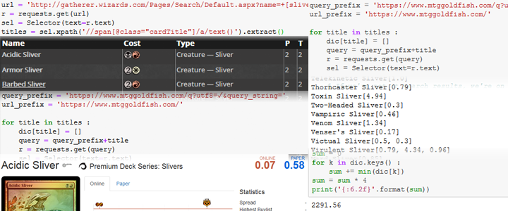

# Soslan Guchmazov - Junior Programmer
## C + Python generalist based in Moscow, Russia

## Hire me!
### I'm looking for full-time or contract remote work in any of the following areas:
- United States of America
- United Kingdom
- Canada

## Portfolio

### C & Vulkan projects
   These entries find Vulkan SDK folders and dynamically extract every function needed to work from its library and
the viewer requires a couple of API extensions that should be present on most GPUs currently in use(mine certainly isn't new!).

   Footage of my every Vk-C project was produced by **ffmpeg** stitching together screenshots captured from
within the applications; presented on this page are 24fps gifs, clickable and leading to short Youtube 60fps videos.
   This feature, while being developed in the "Triangle" entry, is on full display 
and accessible only in the "Viewer" project.

   The entries make use of the excellent single-header [STB libraries](https://github.com/nothings/stb) written by [Sean Barrett](https://github.com/nothings/) for rendering of text, reading and writing of images.

 

#### [Asynchronious Vulkan-based thumbnail-generating image viewer.](https://github.com/SoslanGM/Vulkan_AsyncFolderImageViewer)
   This application obtains a list of images of most commonly used formats(.jpg, .bmp and .png) in a folder specified
in source.cpp, using Win32 functions. It then, using multiple threads, loads and renders the images as smaller-sized
thumbnails, allowing you to scroll through your folder.
   It can handle folders worth of several hundred images(potentially up to 4096 images, utilizing special extensions),
with maximum size of up to 25 megabytes.

#### ["A Flappy Fish".](https://github.com/SoslanGM/Vulkan_FlappyFish)
   This is a simple recreation of the popular "Flappy Bird" game, with the assets from **"Super Mario Bros."**(© Nintendo)

#### ["The Spinning Triangle."](https://github.com/SoslanGM/Vulkan_ASpinningTriangle)
   This is the ["Black Triangle"](http://rampantgames.com/blog/?p=7745) of my recent Vulkan trip, and it took me a bit
to remember how to even output a triangle. I decided to make this the last one, and cooked it to perfection, making it
the basis of the framework in which I wrote the following two entries; trying out for the first time a memory management
scheme of a humble, yet effective, memory pool into which all further geometry writes are written; and convenient text
overlay system allowing for convenient layout, for debugging purposes and others.

### Python projects
   These entries are written in Jupyter Notebook.
   
#### [Business analytics: Lending Club open dataset, 2007-2011](analytics.html)
   Armed with **Pandas**, **Numpy**, **Pyplot** and **Seaborn**, I look into the activity of a lending company, to see if I could reason a little bit about how the business is across America and in individual states, and whether an imaginary reallocation of offices is would make business sense, constructing a **PostgreSQL** database in the process with the help of **SQLAlchemy** library.

#### [Youtube playlist generation for a desktop media player](playlist.html)
   Using **Youtube Data v3** and Google's own authentication libraries, I search through the "Geek and Sundry" channel, find Day\[9\]'s "Spellslingers"  series' playlist, extract and format it to fit my media player of choice.

#### [A price of MtG tribe's card collection](web_scraping.html)
   Gently scraping two databases of Magic the Gathering cards with **Requests** and **Scrapy**, I first find out all the names of cards from a certain collection, and then how much a full set of them, four copies each, can cost.

#### [Downloading a podcast from Apple Music RSS feed](rss.html)
   In goes an .rss URL, out goes a folder full of .mp3 files. Simple as that. Starring: **BeautifulSoup**.

# Experience
## Education:
### 2005-2009, **Moscow IT Lyceum 1533**, programming.
- Basics of programming, C++, C#, ASM
- Basics of system architecture
### 2009-2011, **Bauman's Moscow State Technical University**, programming.
- Basics of programming, Delphi
- Basics of programming, C
### [DataCamp](https://www.datacamp.com/profile/soslangm)
- Python: Pandas, web scraping
- SQL: Basics of PostgreSQL and SQLAlchemy

## Last places of employment:
### Sep 2015 - Jan 2016, **Gameboloid**, "Woodland Quest", match-3 game.
- Integration of Appodeal ad-serving library
- Feature support and bug fixes
- UI elements
- Additional animations for characters
### Mar 2016 - Dec 2018, **Russian Post**, postal operator
- Customer service: preparing customer packages for the transportation
- Data entry: entering of corresponding package data into database
